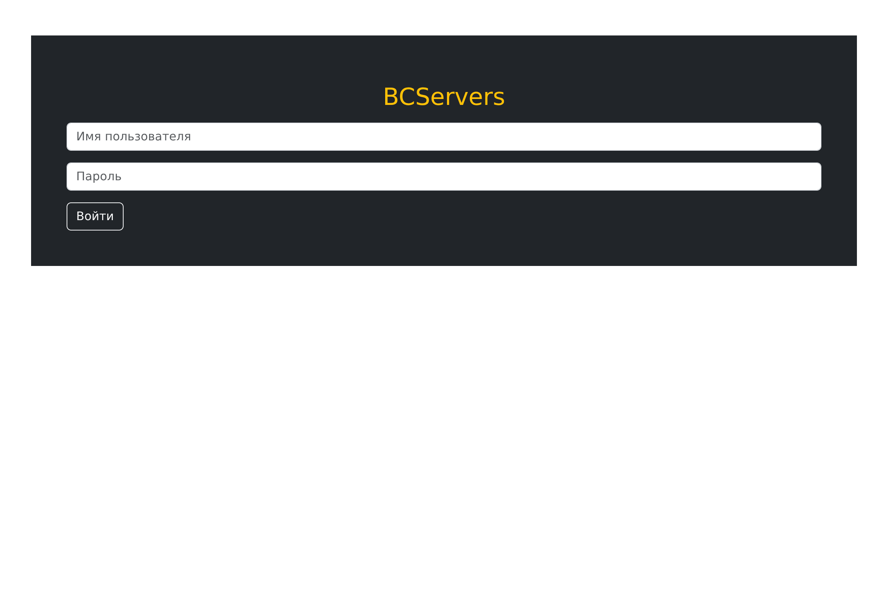
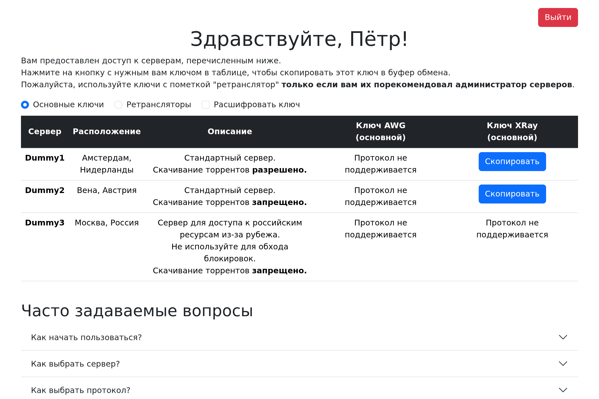

# bcs_website
BCServers project website distributing AWG and XRay VPN server access keys to users.

## db_management
Examples:
```bash
# Create a template for "dummy4" server supporting AWG and Xray
python ./db_management/create_empty_server.py dummy4 ./server_db.json --awg --xray
# Now, fill the details of the server manually in the server_db.json

# Create a user
python ./db_management/create_user.py user4 1234 Вадим ./user_db.json

# Give 5 AWG keys for "dummy4" server to the user
python ./db_management/grant_access.py user4 dummy4 awg 5 ./user_db.json

# Give Xray access for "dummy4" server to the user
python ./db_management/grant_access.py user4 dummy4 xray 1 ./user_db.json

# Revoke given AWG keys
python ./db_management/revoke_access.py user4 dummy4 awg ./user_db.json

# Delete the user
python ./db_management/delete_user.py user4 ./user_db.json

# Generate wg0.conf and clientsTable for AWG server
python ./db_management/generate_srv_conf.py dummy1 awg ./user_db.json ./server_db.json ./srv/awg/
# Generate server.json and clientsTable for Xray server
python ./db_management/generate_srv_conf.py dummy1 xray ./user_db.json ./server_db.json ./srv/xray/
```

## Website screenshots

